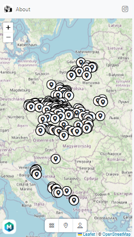
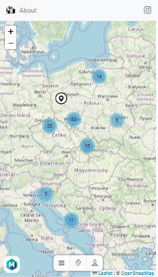
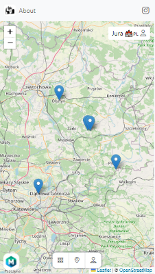
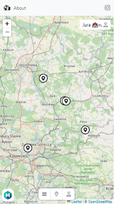

### Features

You can configure ceratin app features i.e. map display options 

 - Select `Domains` sidebar option.
 - Pick `Domain settings` from `Settings` section

 #### Display map marker cluster

 Group location markers into marker clusters

 
 

 #### Display custom map marker icon

Displays default or cuctom map icon

