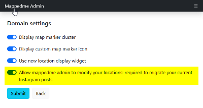

 The Process of migrating your existing Instagram posts to Mappedme requires some manual work and cannot be fully automated.  
 If you want your posts to be migrated contact us - we will do that for you.

 When we are ready to migrate your existing posts we contact you and ask you to turn on a following domain setting:

This allows us to configure your new posts and locations in an automatic way. When the process is finished you can disable the setting so we cannot modify your posts and locations anymore.

