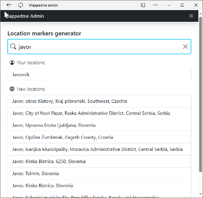
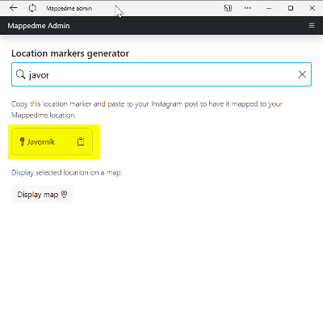
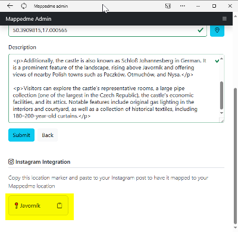

### Automatic location creation

#### 1. Generate location marker

- Navigate to `Instagram` menu option.
- In `Post tools` section click `Create location marker` button.
- In `Location markers generator` enter your location name.

- Pick location name.

You have two options here:  
If you would like to create a new location pick location name from `New locations`. Post will be added to a new location.  
If you would like to add a post to existing location pick its name from `Your locations`. Post will be added to existing location.

- Copy location marker.

#### 2. Add location marker to Instagram post

- Paste location marker into your Instagram post description so there is a separate line with location marker only.

 

 Your post will be added to your location during next Instagram integration.

### Manual location creation

#### 1. Generate location marker

- Use your existing location name or create a new one: [Create location](locationCreation.md)

- open location details and copy location marker 

   
#### 2. Add location marker to Instagram post
   
- Paste location marker into your Instagram post description so there is a separate line with location marker only.

  

Your post will be assigned to your location during next Instagram integration.
