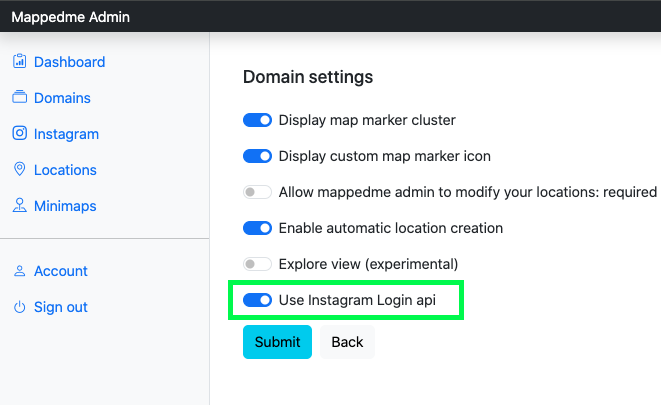
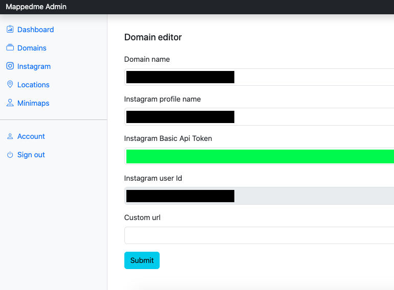
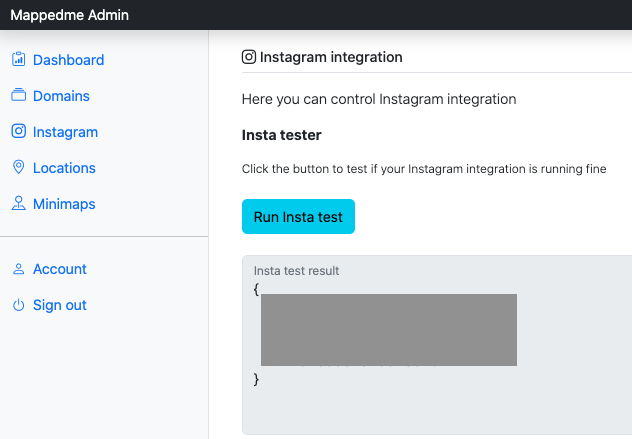

### Instagram integration 

- Go to your domain and select Settings.   
Enable _Use Instagram Login api_ option

- Go to your domain and select `Edit domain`.   
Paste yout Instagram token

After you clicked `Submit` `Instagram user Id` should be filled.

- navigate to `Instagram` menu option
- Scroll to `Instagram integration` section.  
Hit `Run Insta Test` button.  
You should have `Insta test result` filled:  

- Start Instagram integration process.
Hit `Run Insta integration` button.  
You should receive a simillar result:  

Instagram integration is done in the backgorund and usaully takes a few seconds. It is enough to do that once a day or after adding a new Instagram post. Do not run it too often as your Facebook Instagram API app has tight request limits. 
