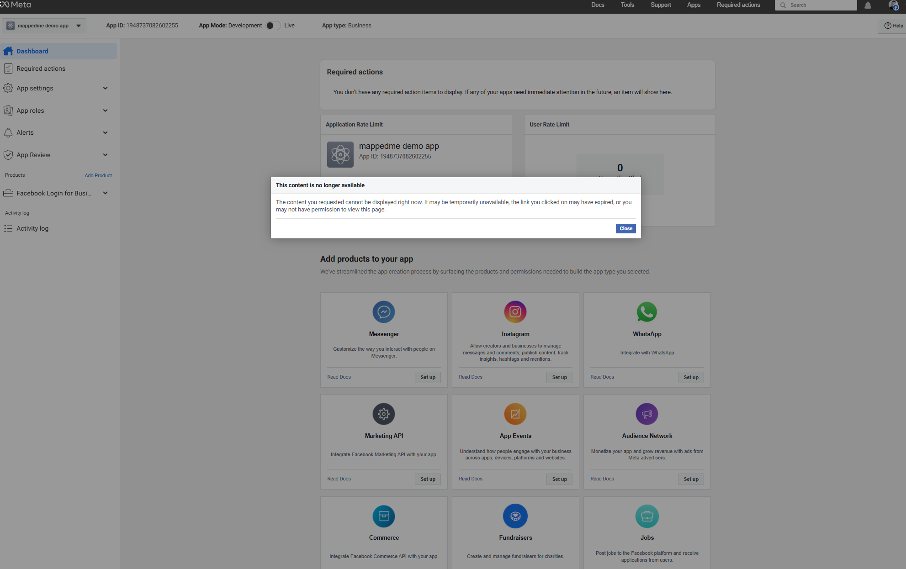

### How to get Instagram Basic API token

#### 1. Create and configure Facebook Developer Account
  
  - Go to [Meta for developers page](https://developers.facebook.com/)
  - Log in and configure your Facebook Developer Account. 
  - Use your Facebook account. Facebook might ask you to authorize with sms sode.
  Tutorial:
    
  

#### 2. Generate Instagram Basic Api Token

- Go to [Meta for developers page](https://developers.facebook.com/apps/)
- Generate Instagram API token and configure Mappedme Instagram integration. Tutorial:

##### Issues 
You might experience issues when adding Instagram to your Facebook app. This is a known Facebook issue that occurs from time to time. If you encounter it, keep trying to add it — if it doesn’t work, try again the next day. Eventually, you should be able to add it successfully and complete the token generation.
