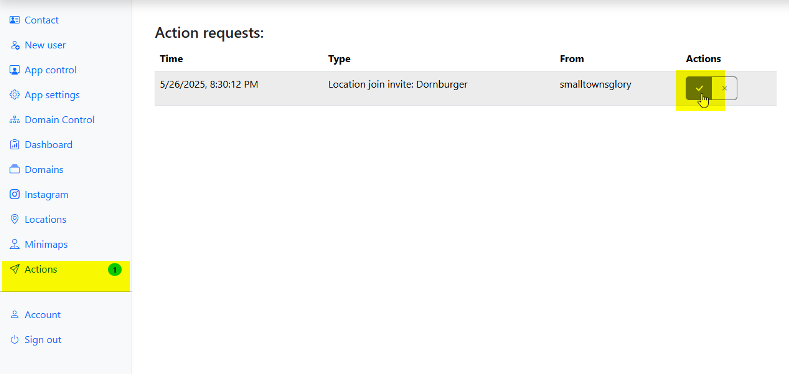
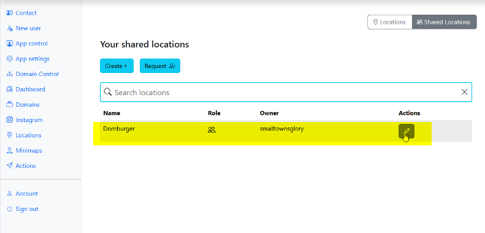
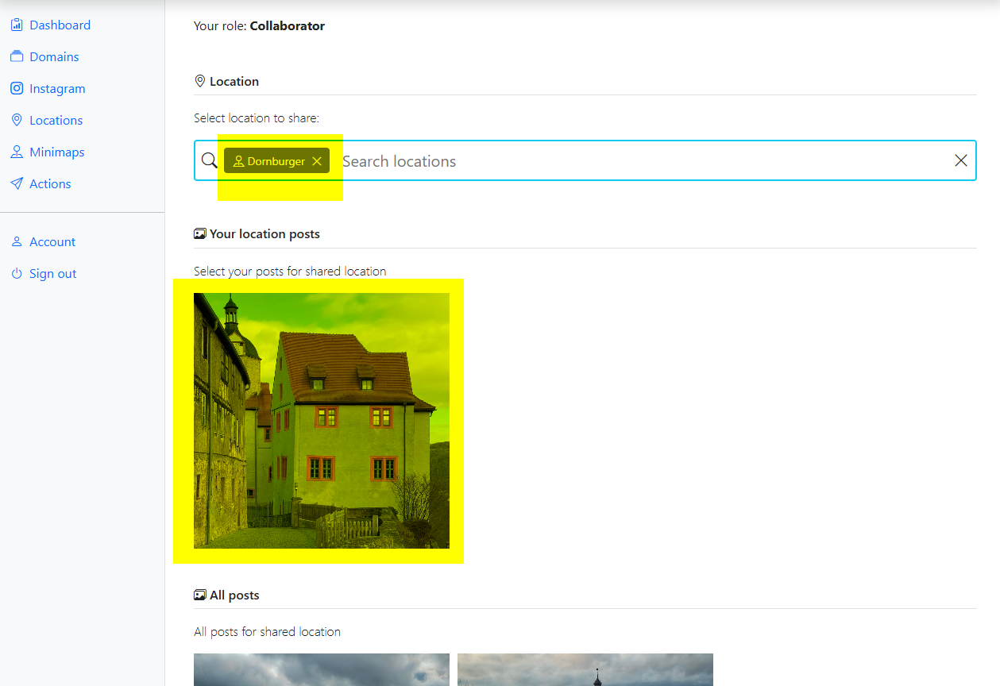

### Shared locations

Shared locations is a feature that allows sharing locations across multiple domains. There is always one owner and one/many collaborators.
Owner is able to extend their location and pick photos to be shared. Collaborators are able to add their photos to the shared location if they accept the invites sent by the owner.

#### Adding photos to shared location 

1. Accept the invite from location owner

2. Find shared location and click edit

3. Find your location and pick photos you would like to add to the shared location

4. Save. You photos will be disabled for the location along with photos of the owner and other collaborators.
